# Rosen Bridge
Rosen bridge is an Ergo-centric bridge enabling users to send and receive coins and tokens between Ergo and any other chain. In this document, we will explain the Rosen bridge design technically. You may also want to read about Rosen bridge's high-level concepts [here](https://github.com/rosen-bridge).

## Rosen Bridge Components
Before explaining the main idea and procedures, it's better to get familiar with its components and concepts:

### Roles
1. **Guard:** A guard is a trusted party performing final actions in the system. Actually, a set of trusted guards are needed to transfer money between chains. The guard set is a small set including real parties. Each guard individually verifies the events and performs the required action. However, all (or a quorum of) guards should agree on one event to make the final operation.

2. **Watcher:** As the name suggests, watchers are some volunteer participants who watch two chains to create the transfer events. After a quorum of watchers reported the same event, a watcher will make an event trigger for guards. Watchers are not trusted and may have faults, intentionally or unintentionally. Anyway, the guilty watcher will be fined for his faulty action, and on the other hand, honest watchers will be rewarded.


### Tokens
1. **Rosen Bridge Token (RSN):** The Rosen bridge token defines the bridge participation rights. Each person who has a portion of this token can participate in the bridge as a watcher.

2. **X-Rosen Watcher Token (X-RWT):** Each watcher volunteer needs to lock his RSN tokens to be a watcher of a specific bridge. The legitimate watchers receive X-RWT tokens on behalf of their RSN. Each of these tokens can be used to create new events, and if the event were true, guards would return the X-RWT to the watcher. RWT is a chain-specific token; thus, chain X watchers will use X-RWTs for event creation.

3. **Guard NFT:** This NFT belongs to the bridge wallet, a multi-sig address of guards. Thus, if it was spent in a transaction input, it means that guards agreed on that transaction. This NFT is used for system update transactions.

4. **X-Cleanup NFT:** This token is the cleanup service identifier. We have different cleanup services for each registered bridge.

5. **Watcher Identifier Token (WID Token):** After locking RSNs by a volunteer, the X-RWT tokens are paid to the watcher as well as a newly issued token that identifies the watcher. A watcher may have multiple X-RWT tokens, enabling him to simultaneously create different events on one bridge. Though, the WID token is a unique token that identifies the watcher (we may decide to use a set of WID tokens to handle the concurrency, but it won't damage its uniqueness concept). The watcher must use his WID token to authenticate every new event generation, reward reception, or X-RWT token redemption actions.


### Contracts

1. **X-Bridge Wallet:** This is a simple multi-sig address storing all X-wrapped tokens. All guards must agree on a payment transaction in order to spend this box and pay the requested tokens to the user.

1. **X-RWT Repo:** This contract is the system configuration for each chain. This contract is responsible for tracking the corresponding X-RWT tokens and locking RSNs to emit new X-RWTs. It stores the X-RWT/RSN factor, the quorum percentage of watchers, and the maximum needed event commitment count for this chain. It also stores the list of available watcher WIDs alongside their X-RWT token count.

2. **X-Watcher Permit:** When a new watcher is registered, his X-RWT tokens would be locked in this contract. It also stores the WID in the registers. It can be spent only if the WID token exists in the spending transaction.

3. **X-Event Commitment:** When a watcher detects a new event on the target chain, it creates an event commitment.

4. **X-Event Trigger:** A watcher creates the event trigger after a quorum of watchers reported the same event. He will spend all commitments and reveals the event contents to generate the event trigger. It also stores the reporter WIDs in the event trigger that the guards will process.

5. **X-Fraud:** Some watchers may create faulty events. The guards will process the faulty events if a quorum of watchers created that event (resulting in an event trigger), but guards will ignore these triggers since they are not verifiable. After a while, the cleanup service collects all these faulty events and moves their X-RWT tokens to the fraud contract as punishment. The fraud contract will be spent to redeem RSNs from the X-RWT repo.


### Data

1. **Event**: Any payment request from one chain to the other one. Event contains:
    1. Source tx id
    3. From chain
    4. To chain
    5. From address
    6. To address
    7. Amount
    8. Bridge fee
    9. Source chain token id
    10. Target chain token id
    11. Source block id
    12. Network fee

12. **Commitment:** The event report created by the watchers. The commitment contains:
    1. Watcher WID
    2. Commitment (hash of the event content concatenated by the WID)
    3. Event id (hash of related txId on source chain)

## Rosen Bridge Life Cycle
In this section, we will review the introduced procedures, stored data, and component dependence in detail. These phases are the life cycle of a bridge, but the Rosen bridge is the collection of different such bridges connecting Ergo to the outside world.

### A. Watcher Registration Procedure
Each person who has enough portion of X-RWT tokens can be an X bridge watcher. Thus watcher registration has these steps:

#### 1- Get Watcher Permit
As mentioned earlier, each watcher volunteer needs to lock his RSN tokens to receive corresponding X-RWTs to obtain the watcher permit. So in this transaction, these requirements must be satisfied:

* X-RWT repo data should be updated:
    * Append his WID to the WID list
    * Append the number of receiving X-RWT tokens to the token count list
    * based on X-RWT/RSN factor, pay RSN to the repo and get the X-RWTs
* A watcher permit box is created containing all X-RWT tokens. It also stores the WID in its registers.
* Issue the WID token and send it to the watcher's address.

<p align="center">
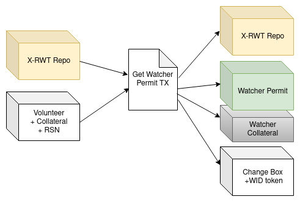
</p>


#### 2- Merge Watcher Permits
In the payment procedure-reward distribution phase (B.4), we will see guards will pay back the X-RWT token besides the watcher reward after accepting the event triggers. A watcher can spend all these boxes with his WID token as authentication. He may want to merge these boxes and extract the collected rewards. Also, he can create a new event commitment while merging boxes (See B.2).

<p align="center">
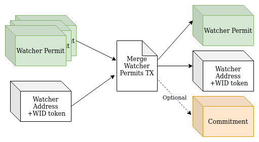
</p>

#### 3- Return Watcher Permit
At any time, a watcher may want to redeem his RSNs (to sell them or to change his bridge). Thus, he should return his watcher permits to unlock the X-RWTs and redeem the RSNs based on the X-RWT/RSN factor stored in the X-RWT repo.
In this transaction, the watcher should update the token count corresponding to his WID, and if he is returning all X-RWTs, he must remove his WID from the registered watchers list.

<p align="center">
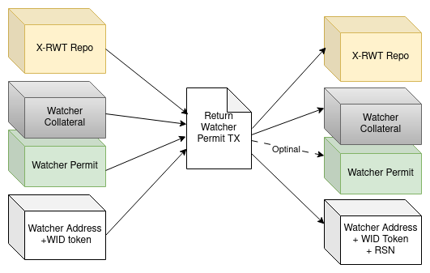
</p>

### B. Payment Procedure

Payment is the main procedure of bridge, in which the user gets involved directly. At first, the user sends his funds to the bridge wallet and creates the transfer request. Then, watchers verify the request and create commitments; once enough commitments are created, one watcher creates the event trigger. Finally, Guards process the event trigger and do the final required actions. As the scenario that the source chain is Ergo is more complicated, we will first focus on sending funds from ergo to chain X. The opposite direction and the differences are all discussed in the end.

#### 1- Transfer Request Creation
A transfer request starts by sending the funds to the bridge wallet on the source chain. While the user sends his funds to the bridge wallet, he stores the transfer request information on the source chain meta-data. (On the Ergo side, it means storing the request information on the created box registers)

<p align="center">
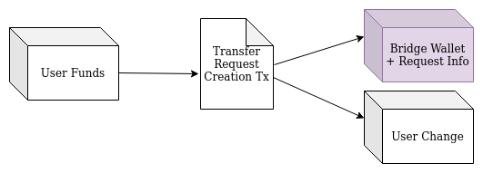
</p>

#### 2- Event Commitment Creation
Each watcher observes both chains and, in case of detecting any valid transfer requests, creates the event commitment in the Ergo network. It also stores the request information in its local database for future usage.
In this transaction:

* Inputs are:
    * Watcher permit box containing X-RWT
    * A box containing his WID token as the first token
    * (Optional) Any other watcher permit boxes in the network can be merged in this transaction (A.2)
* Only one new watcher permit box is created so that all remaining X-RWTs will be aggregated.
* The created commitment box has exactly one X-RWT. It also stores all commitment information in its registers.

<p align="center">

</p>

#### 3- Event Trigger Creation
In this phase, a watcher creates the event trigger after a quorum of watchers reported the same event. He will spend all commitments and reveals the event contents to generate the event trigger.

At first, the watcher finds all commitments with the same id. Then, he verifies the commitments with the event data and the issuer's WID. Finally, if there are sufficient verified commitments, he spends them all and creates the event trigger. Created event trigger stores:

* List of all WIDs merged in this transaction
* Event data

<p align="center">
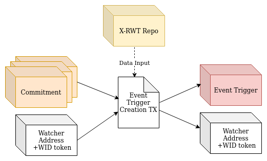
</p>

#### 4- User Payment
Guards process all event triggers, and if the corresponding payment transaction has received enough confirmation on the source chain, they verify the request information.
After a quorum of guards verifications (M out of N guards), they create the target chain transaction paying the tokens to the user.

<p align="center">

</p>

#### 5- Reward Distribution
Finally, the final reward distribution transaction will be done after the payment transaction receives the required confirmation on the target chain. In this transaction:

* Inputs are:
    * Event Trigger
    * Any valid commitment not merged in creating the event trigger
    * bridge wallet to pay the transaction fee
* The reward is distributed between all watchers who created the valid commitment, either merged on the event trigger or spent individually in this transaction. Thus, for each mentioned WID, a watcher permit box with the reward share and one X-RWT is generated.
* Guards receive their reward share
* The payment transaction id on the target chain is stored in the first watcher permit box registers for future audits.

<p align="center">
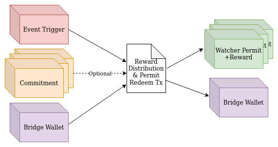
</p>

#### 6- Ergo Target Chain Payment
Till here, all the above payment process explanations were in the status where Ergo is the source chain. In the opposite direction, the process is similar, but the user sends his request and funds to the X-chain bridge wallet, and the final payment transaction is done within the reward distribution. So, in that case, the payment and reward distribution transactions will be like this:

<p align="center">
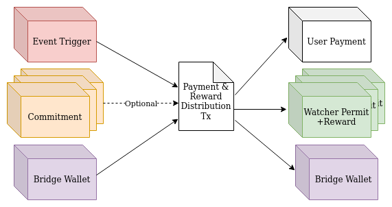
</p>


### C. Fault Handling Procedure
Watchers may have intentional or unintentional faults; all faults should be handled completely by the service.

#### 1- Commitment Redeem
At any time, a watcher can spend the commitment and redeem his X-RWT if the event trigger is not created using that commitment. This situation is most likely to happen when the watcher makes a mistake in a commitment.
This simple transaction only spends the commitment box and creates a watcher permit box containing X-RWT. Besides, the watcher WID token must exist in inputs as the watcher authenticator.

<p align="center">
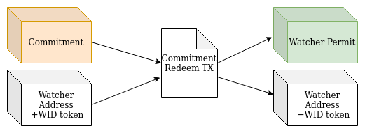
</p>


#### 2- Fraud Detection
If a quorum of guards couldn't verify an event trigger, they would ignore that event. After a while, the cleanup service spends this event trigger and slashes the collected X-RWT tokens (or correspondent RSNs) as the fault penalty. At first, the cleanup service spends the event trigger and generates fraud boxes for each recorded WID. Each fraud box contains precisely one X-RWT.

<p align="center">
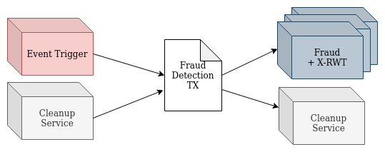
</p>

#### 3- RSN Slash
Finally, the cleanup service spends all created fraud boxes, then redeem and slash their RSN tokens.

<p align="center">
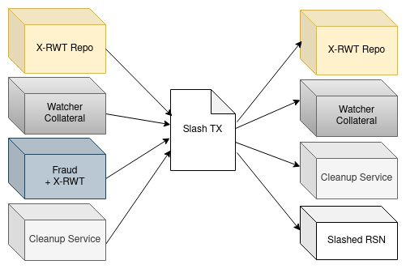
</p>

The cleanup service box with its unique token should exist in both fraud detection and slash transactions.

### D. Service Update Procedure

#### 1. X-RWT Repo Update
X-RWT repo stores some necessary configs related to a bridge. It should keep track of the watchers and tune the maximum watcher counts and watcher quorum percentage based on the network X status.
Thus this box may need to be updated at any time. The guards should compromise on the updated setting and create a new box with the updated information. This updating can be done only if the guard NFT is spent on the updating transaction. Since guard NFT resides in a guard multi-sig address, it means that they could agree on the new setting.

<p align="center">
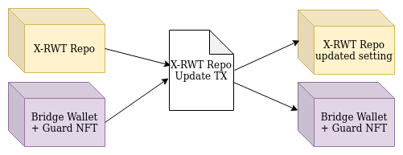
</p>


#### 2. Guards Update
Although guards are trusted parties of this service, the service may need to change some of them in an update. A guard can be removed or added in these update events if a quorum of existing guards could agree on the change. After such an event, all bridge wallets on all chains should be updated with the set of new guards.

This update has different processes and impacts on different chains. In some chains, we use the [TSS tool](https://pkg.go.dev/github.com/binance-chain/tss-lib#section-readme), a threshold signature library available for many existing chains. This update can be simply done in the chains supporting the TSS tool by its resharing mechanism. Moreover, this update won't change the bridge wallet address. However, this update event may affect the addresses in other chains not supporting the TSS; therefore, all bridge wallet assets should be transferred into their new address in such chains before updating the guard set.

Although we won't use the TSS tool on Ergo, this update can be simplified into changing a box that stores the guards' addresses. This update can be done using the Guard NFT, similar to the previous transaction. This event won't affect the bridge wallet address or anything else in the network.


## Rosen Bridge Design Details

### Fee Calculation
There are two types of fees for bridge transfers: the network fee and the bridge fee.

1. Network Fee: Each chain has its own transaction fees that may update dynamically. Thus, the bridge can not consider a fixed network fee for all transactions. Then, we calculate the required network fee online based on that moment's network status. The user can see our fee estimation and either accept the transfer or reject paying that fee.

2. Bridge Fee: All procedures explained above have different costs that must be paid by the user requesting the transfer. So all transfer requests have a bridge fee, which is a percentage of the transferring token.


### Double Payment Protection
One of the most important issues in almost all cryptocurrencies is the double-spent problem. It stands for a situation where a user uses an asset twice; this can occur in bridges independent of their infrastructure. In other words, although the chains are double-spent resistant, the bridge may consider an event twice and pay on the target chain doubled.

To avoid the double payment, we have different mechanisms on each layer:

* **Double event trigger:** Watchers are some untrusted bridge participants. So they may create an event trigger for the same event twice. To avoid the unintentional double trigger creation, we enforce the watchers to create an event trigger only when:
    1. At least 51% of them created the similar commitment
    2. Distinct watchers produced commitments, i.e., commitments have different WIDs

However, they can create event triggers twice, intentionally. In that case, guards' verification should avoid these triggers. And after a while, the cleanup service will redeem their watcher permits as the punishment.

* **Double payment by guards:** Each guard has a local database of the bridge actions and the corresponding transactions. This database helps each guard recognize double-created events and avoid their payments. If one of the guards loses the database, others can provide their own database, and he can simply verify all its content with the on-chain data. Otherwise, he can create his database from scratch by indexing the recorded data on the chains. In both cases, the guard may need to wait for a while before taking action to make sure the obtained information is valid.

### Guards Agreement Protocol
It will be completed soon.

### Service Audit
Rosen bridge is a bridge with publicly available data and actions. Thus, all actions can be verified by any network observer. If anyone wants to observe and verify the bridge by himself, he needs to track these addresses:

1. Bridge Wallets: All transfer requests are initiated by sending funds to the bridge wallet, so by tracking the bridge wallet address, everyone can obtain the requests information.
2. Event Trigger: On the other side, all bridge payments are made after a trigger. By observing the event triggers created by the watchers and their final results, all bridge payments can be extracted.

The verifier only needs to verify that "A bridge payment is made if and only if a transfer request is created."

# Contract Project
This project is used for creating a centralized file to the address of contracts and TokenMaps depending on network and network type, all libraries and projects in Rosen Bridge are compatible with the outputs of these files.

## How to use ?
To build:
```shell
sbt run assembly
```

To create TokenMap file run this command (this is an example for testnet):
```shell
java -jar target/scala-2.12/contract-assembly-0.1.0-SNAPSHOT.jar tokens --type testnet --version 1.0.0
```

To create address of all contracts run this command (this is an example for cardano network with testnet type):
```shell
java -jar target/scala-2.12/contract-assembly-0.1.0-SNAPSHOT.jar contracts --network cardano --type testnet --version 1.0.0
```

You can see all commands with:
```shell
java -jar target/scala-2.12/contract-assembly-0.1.0-SNAPSHOT.jar --help 
```
