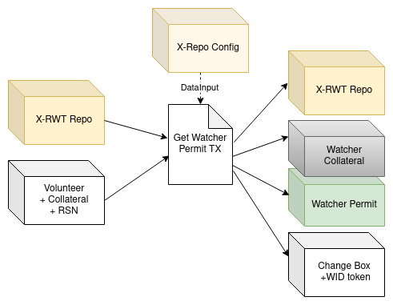
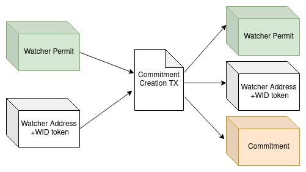
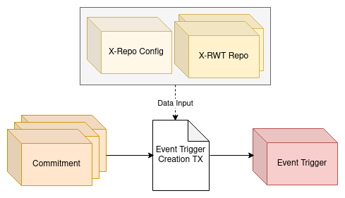
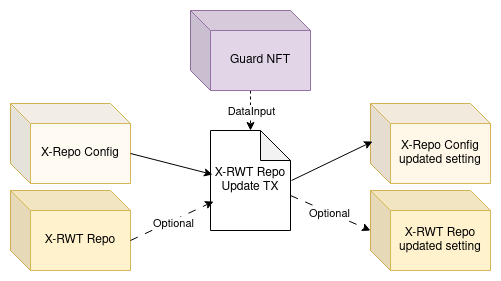

# Rosen Bridge
The Rosen Bridge is an Ergo-centric bridge designed to facilitate the seamless exchange of coins and tokens between the Ergo blockchain and other supported chains. In this document, we will delve into the technical intricacies of the Rosen Bridge's design. For a broader understanding of the Rosen Bridge's high-level concepts, you can refer to this [link](https://github.com/rosen-bridge).

## Rosen Bridge Components
To gain a comprehensive understanding of the Rosen Bridge and its operations, it's essential to get familiar with its core components and concepts:

### Roles
1. **Guard:** A guard serves as a trusted entity responsible for executing final actions within the system. In practice, a set of trusted guards is essential for facilitating cross-chain transfers. Each guard independently verifies events and carries out the necessary actions. However, for a final operation to proceed, all guards (or a quorum) must reach a consensus on a specific event.

2. **Watcher:** As the name implies, watchers are volunteer participants tasked with watching chains to create transfer reports. Once a quorum of watchers reported the same event, a watcher initiates the event trigger for the guards. Watchers are not trusted and may exhibit faults, whether intentionally or accidentally. In such cases, the responsible watcher is subject to penalties for their erroneous actions, while honest watchers are duly rewarded after each report.

### Tokens
As previously mentioned, Rosen operates as an Ergo-centric bridge, with the primary procedures designed to run on the Ergo network. In addition to tokens that are transferred on the bridge, transfer procedures involve the use of administrative tokens on the Ergo network, each serving distinct functions:

1. **Rosen Bridge Token (RSN):** The Rosen bridge token defines the bridge participation rights. Holders of this token are eligible to engage as watchers within the bridge ecosystem.

2. **Guard NFT:** This NFT  is collectively owned by the guards and its expenditure represents a consensus among guards on a transaction. This NFT resides in a multi-signature address controlled by the guards, then its presence in a transaction input signifies the approval of the guards. It is used for transfer payments and system update transactions.

3. **RWT Repo NFT:** RWT Repo is responsible for keeping track of X-RWT tokens (as watcher permits) and exchanging them by RSN. This NFT serves as an identifier for verified repos associated with each chain.

4. **X-Rosen Watcher Token (X-RWT):** Watcher volunteers are required to lock their RSN tokens to become watchers of a specific chain. The legitimate watchers receive X-RWT tokens in exchange of their RSN tokens. Each pack of these tokens can be used to create a new action report. If the report was correct, guards will return the X-RWT tokens to the respective watcher. RWT is a chain-specific token; thus, chain X watchers will employ X-RWT tokens for report creation.

5. **X-Cleanup NFT:** This token is the cleanup service identifier. Different cleanup services are available for each registered chain, responsible for eliminating older, unused boxes, which may potentially involve fraudulent activity.

6. **Watcher Identifier Token (WID Token):** After a volunteer locks their RSN tokens, they receive X-RWT tokens as well as a newly issued token that serves as their unique watcher identifier. A watcher may possess multiple X-RWT tokens, allowing them to concurrently create various reports for a chain. However, the WID Token is a unique token assigned to each watcher, which they must utilize to authenticate actions like new report generation, reward receipt, or X-RWT token redemption. Despite its uniqueness, it's minted in three instances. To mitigate the risk of watcher wallet exposure, the watcher employs only one of these tokens for routine watcher operations, but the watcher is required to use at least two of them for lock or unlock actions (the watcher owner has the option to store two WID tokens in a separate secure wallet).

7. **X-Authorized Watcher Collateral NFT (X-AWC NFT):** To prevent the creation of arbitrary boxes similar to the watchers' collateral boxes, the authorized ones will receive this NFT. They are chain-specific tokens and they all reside in the corresponding Rwt-Repo box at the beginning.

8. **X-Repo Config NFT:** Each chain has a unique configuration for watchers, all of which are stored in the RWT-Repo box. This configuration box has a unique NFT for each chain.

### Contracts

To execute bridge operations, Rosen utilizes a straightforward multi-signature wallet on each supported chain. This wallet (X-Chain Wallet), contains all X-native and X-wrapped tokens.
To transfer assets from this wallet and issue the requested tokens to users, an agreement among all guards is required (signing the same transaction).
Rather than these simple multi-sig wallets, more complicated procedures are designed on ergo which requires ergo-side contracts. These contracts include:

1. **Ergo-Chain Wallet:** Similar to other X-Chain Wallets, all ergo-wrapped tokens resist in this wallet. However, in order to simplify ergo-side bridge config updates its not a simple multi-sig wallet. 
Boxes governed by this contract can only be spent when the Guard NFT is included in the spending transaction.

2. **Guard Sign:** Guard sign is a box that stores all guard pks, required sign thresholds, and the guard NFT.
To perform asset transfers and configuration updates, guards must spend this box by signing transactions with their secrets. 
As guard public keys are stored within this box's registers, updating the guard set in the Ergo network is as straightforward as executing a standard multi-signature transaction. This eliminates the need to alter bridge addresses or transfer assets to a new wallet.

3. **X-RWT Repo:** It is responsible for tracking the corresponding X-RWT tokens and locking RSNs to emit new X-RWTs.

4. **X-Repo Config:** This contract governs the system configuration for each supported chain. It stores the number of required X-RWTs for each event commitment, the quorum percentage of watchers, the maximum needed event commitment count for this chain, and needed watcher collateral in ERG and RSN. It also stores the number of RWT Repo boxes for it's chain.

5. **Watcher Collateral:** Watchers are required to provide a security deposit or collateral as part of their participation in the bridge. This collateral is safely kept in this contract. Whenever the watcher redeems its permits, the collateral will automatically returned to their address. Additionally, this contract protects the number of total permits of this watcher.

6. **X-Watcher Permit:** When a new watcher registers, their X-RWT tokens are locked within this contract. Furthermore, the contract stores the WID (Watcher Identifier) in its registers. It can only be spent if the corresponding WID token exists within the spending transaction.

7. **X-Event Commitment:** This contract comes into play when a watcher detects a new event on the observing chain. Then, the watcher creates a report commitment with the event data digest.

8. **X-Event Trigger:** A watcher creates the event trigger after a quorum of watchers reported the same event. This action involves spending all commitments and revealing the event's contents. The event trigger also stores the digest of the reporting watchers' wid list.

9. **X-Fraud:** Occasionally, watchers may create erroneous or fraudulent reports. Guards will process these events if a watcher generates the event trigger (after a quorum of watchers generated the corresponding commitment). However, guards will disregard these triggers as they are not verifiable. After a while, the cleanup service collects these faulty triggers and transfers their associated X-RWT tokens to the fraud contract as a form of penalty.


### Data

1. **Event**: Any payment request from one chain to the other one. Event contains:
    1. Source tx id
    3. From chain
    4. To chain
    5. From address
    6. To address
    7. Amount
    8. Bridge fee
    9. Source chain token id
    10. Target chain token id
    11. Source block id
    12. Network fee

12. **Commitment:** The event report created by the watchers. The commitment contains:
    1. Watcher WID
    2. Commitment (hash of the event content concatenated by the WID)
    3. Event id (hash of related txId on source chain)

## Rosen Bridge Life Cycle
In this section, we will delve into a comprehensive examination of the introduced procedures, stored data, and component interdependencies. These phases collectively represent the life cycle of a bridge (between two chains). It's important to note that the Rosen Bridge comprises a collection of such bridges that connect Ergo to the external world.

### A. Watcher Registration Procedure
Any individual possessing a sufficient amount of X-RWT tokens can become a X-chain watcher. Thus watcher registration has these steps:

#### 1- Get Watcher Permit
As mentioned earlier, each watcher volunteer needs to lock his RSN tokens to receive corresponding X-RWTs to obtain the watcher permit. So in this transaction, these requirements must be satisfied:

* X-RWT repo data should be updated:
    * Pay RSN to the repo and get the respective X-RWTs tokens
    * Use one AWC NFT to create the collateral box
* A Collateral box is created containing the required collateral for the watcher and the AWC NFT. It also stores the total number of watcher permits.
* A watcher permit box is created containing all X-RWT tokens. It also stores the WID in its registers.
* Issue at least 3 WID tokens and send them to the watcher's address.

<p align="center">

</p>


#### 2- Return Watcher Permit
At any given time, a watcher may wish to withdraw their RSN tokens, whether for the purpose of selling them or watching a different chain. To facilitate this, the watcher must return their watcher permits to unlock the X-RWTs and initiate the withdrawal of RSN tokens.

In this transaction, the watcher is required to update the token count associated with their WID (Watcher Identifier Token) stored in collateral box.

<p align="center">

</p>


If a watcher returns all the corresponding X-RWT tokens, then the collateral can be withdrawn accordingly. It will return all RWT tokens and the AWC NFT and receive the locked RSN.

<p align="center">

</p>

### B. Payment Procedure

Payment is the main procedure of bridge, in which the user gets involved directly. At first, the user sends his funds to the bridge wallet and creates the transfer request. Then, watchers verify the request and create commitments; once enough commitments are created, one watcher creates the event trigger. Finally, Guards process the event trigger and do the final required actions. As the scenario that the source chain is Ergo is more complicated, we will first focus on sending funds from ergo to chain X. The opposite direction and the differences are all discussed in the end.

#### 1- Transfer Request Creation
A transfer request starts by sending the funds to the bridge wallet on the source chain. While the user sends his funds to the bridge wallet, he stores the transfer request information on the source chain meta-data. (On the Ergo side, it means storing the request information on the created box registers)

<p align="center">

</p>

#### 2- Event Commitment Creation
Each watcher observing chain X, upon detecting valid transfer requests, generates a commitment report within the Ergo network. Additionally, it maintains the request information in its local database for potential future use.
In this transaction:

* Inputs include:
    * Watcher permit box containing X-RWT
    * A box containing his WID token as the first token
    * (Optional) Any other watcher permit boxes in the network can be merged in this transaction (A.2)
* Only one new watcher permit box is created, containing all remaining X-RWTs.
* The newly created commitment box contains a quantity of X-RWT tokens based on the specified amount required in X-RWT-Repo. It also stores all commitment-related information within its registers.

<p align="center">

</p>

#### 3- Event Trigger Creation
In this phase, a watcher creates the event trigger after a quorum of watchers reported the same event. The watcher will spend all commitments and reveals the event contents to generate the event trigger.

At first, the watcher finds all commitments with the same id. Then, he verifies the commitments with the event data and the issuer's WID. Finally, if there are sufficient verified commitments, he spends them all and creates the event trigger. Created event trigger stores:

* Digest of all WIDs contributed to create this trigger
* Event data

<p align="center">

</p>

#### 4- User Payment
Guards process all event triggers, and if the corresponding payment transaction has received enough confirmation on the source chain, they verify the request information.
After a quorum of guards verifications (M out of N guards), they create the target chain transaction paying the tokens to the user.

<p align="center">

</p>

#### 5- Reward Distribution
Finally, the final reward distribution transaction will be done after the payment transaction receives the required confirmation on the target chain. In this transaction:

* Inputs are:
    * Event Trigger
    * Any valid commitment not merged in creating the event trigger
    * bridge wallet to pay the transaction fee
* The reward is distributed between all watchers who created the valid commitment, either merged on the event trigger or spent individually in this transaction. Thus, for each mentioned WID, a watcher permit box with the reward share and one X-RWT is generated.
* Guards receive their reward share
* The payment transaction id on the target chain is stored in the first watcher permit box registers for future audits.

<p align="center">

</p>

#### 6- Ergo Target Chain Payment
Till here, all the above payment process explanations were in the status where Ergo is the source chain. In the opposite direction, the process is similar, but the user sends his request and funds to the X-chain bridge wallet, and the final payment transaction is done within the reward distribution. So, in that case, the payment and reward distribution transactions will be like this:

<p align="center">

</p>


### C. Fault Handling Procedure
Watchers may have intentional or unintentional faults; all faults should be handled completely by the service.

#### 1- Commitment Redeem
At any time, a watcher can spend the commitment and redeem his X-RWT if the event trigger is not created using that commitment. This situation is most likely to happen when the watcher makes a mistake in a commitment.
This simple transaction only spends the commitment box and creates a watcher permit box containing X-RWT. Besides, the watcher WID token must exist in inputs as the watcher authenticator.

<p align="center">

</p>


#### 2- Fraud Detection
If a quorum of guards couldn't verify an event trigger, they would ignore that event. After a while, the cleanup service spends this event trigger and slashes the collected X-RWT tokens (or correspondent RSNs) as the fault penalty. At first, the cleanup service spends the event trigger and generates fraud boxes for each recorded WID. Each fraud box contains precisely one X-RWT.

<p align="center">

</p>

#### 3- RSN Slash
Finally, the cleanup service spends all created fraud boxes, then redeem and slash their RSN tokens.

<p align="center">

</p>

The cleanup service box with its unique token should exist in both fraud detection and slash transactions.

### D. Service Update Procedure

#### 1. X-RWT Repo Update
Upon any update on the bridge, the X-RWT Repo and X-Repo config may need to receive updates accordingly. Then both these boxes can be updated in a transaction with the guard NFT in data input. The guards should compromise on the update and create a new box with the updated information. This updating can be done only if a quorum of guards sign the update transaction.

Repo Config store some necessary configs related to a bridge, and it may receive updates periodically. It should keep track of the watchers and tune the maximum watcher counts and watcher quorum percentage based on the network X status.

<p align="center">

</p>


#### 2. Guards Update
Although guards are trusted parties of this service, the service may need to change some of them in an update. A guard can be removed or added in these update events if a quorum of existing guards could agree on the change. After such an event, all bridge wallets on all chains should be updated with the set of new guards.

This update has different processes and impacts on different chains. In some chains, we use the [TSS tool](https://pkg.go.dev/github.com/binance-chain/tss-lib#section-readme), a threshold signature library available for many existing chains. This update can be simply done in the chains supporting the TSS tool by its resharing mechanism. Moreover, this update won't change the bridge wallet address. However, this update event may affect the addresses in other chains not supporting the TSS; therefore, all bridge wallet assets should be transferred into their new address in such chains before updating the guard set.

Although we won't use the TSS tool on Ergo, this update can be simplified into changing a box that stores the guards' addresses. This update can be done using the Guard NFT, similar to the previous transaction. This event won't affect the bridge wallet address or anything else in the network.


## Rosen Bridge Design Details

### Fee Calculation
There are two types of fees for bridge transfers: the network fee and the bridge fee.

1. Network Fee: Each chain has its own transaction fees that may update dynamically. Thus, the bridge can not consider a fixed network fee for all transactions. Then, we calculate the required network fee online based on that moment's network status. The user can see our fee estimation and either accept the transfer or reject paying that fee.

2. Bridge Fee: All procedures explained above have different costs that must be paid by the user requesting the transfer. So all transfer requests have a bridge fee, which is a percentage of the transferring token.


### Double Payment Protection
One of the most important issues in almost all cryptocurrencies is the double-spent problem. It stands for a situation where a user uses an asset twice; this can occur in bridges independent of their infrastructure. In other words, although the chains are double-spent resistant, the bridge may consider an event twice and pay on the target chain doubled.

To avoid the double payment, we have different mechanisms on each layer:

* **Double event trigger:** Watchers are some untrusted bridge participants. So they may create an event trigger for the same event twice. To avoid the unintentional double trigger creation, we enforce the watchers to create an event trigger only when:
    1. At least 51% of them created the similar commitment
    2. Distinct watchers produced commitments, i.e., commitments have different WIDs

However, they can create event triggers twice, intentionally. In that case, guards' verification should avoid these triggers. And after a while, the cleanup service will redeem their watcher permits as the punishment.

* **Double payment by guards:** Each guard has a local database of the bridge actions and the corresponding transactions. This database helps each guard recognize double-created events and avoid their payments. If one of the guards loses the database, others can provide their own database, and he can simply verify all its content with the on-chain data. Otherwise, he can create his database from scratch by indexing the recorded data on the chains. In both cases, the guard may need to wait for a while before taking action to make sure the obtained information is valid.

### Guards Agreement Protocol
It will be completed soon.

### Service Audit
Rosen bridge is a bridge with publicly available data and actions. Thus, all actions can be verified by any network observer. If anyone wants to observe and verify the bridge by himself, he needs to track these addresses:

1. Bridge Wallets: All transfer requests are initiated by sending funds to the bridge wallet, so by tracking the bridge wallet address, everyone can obtain the requests information.
2. Event Trigger: On the other side, all bridge payments are made after a trigger. By observing the event triggers created by the watchers and their final results, all bridge payments can be extracted.

The verifier only needs to verify that "A bridge payment is made if and only if a transfer request is created."

# Contract Project
This project is used for creating a centralized file to the address of contracts and TokenMaps depending on network and network type, all libraries and projects in Rosen Bridge are compatible with the outputs of these files.

## How to use ?
To build:
```shell
sbt run assembly
```

To create TokenMap file run this command (this is an example for testnet):
```shell
java -jar target/scala-2.12/contract-assembly-0.1.0-SNAPSHOT.jar tokens --type testnet --version 1.0.0
```

To create address of all contracts run this command (this is an example for cardano network with testnet type):
```shell
java -jar target/scala-2.12/contract-assembly-0.1.0-SNAPSHOT.jar contracts --network cardano --type testnet --version 1.0.0
```

To create both TokenMaps and address of contracts for each network type run this command (there's a `-f` flag for filter networkTypes):
```shell
java -jar target/scala-2.12/contract-assembly-0.1.0-SNAPSHOT.jar all --version 1.0.0
```

You can see all commands with:
```shell
java -jar target/scala-2.12/contract-assembly-0.1.0-SNAPSHOT.jar --help 
```
